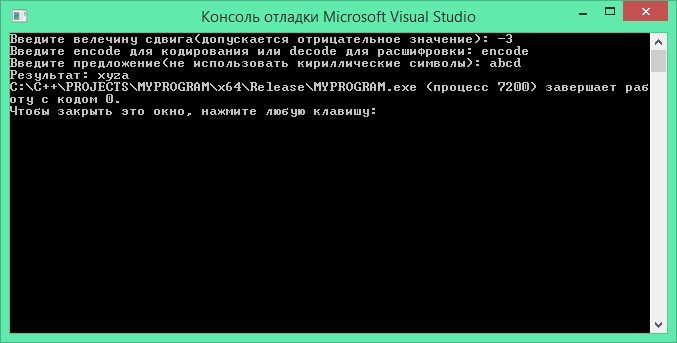

# Мануал для работы с программой
Программа ждет, чтоб пользователь ввел значение сдвига для шифра, затем программа ждет введения команды пользователя(encode или decode), потом предложение которое надо закодировать или раскодировать. В цикле перебираются все символы предложения, и если текущий символ находится в диапозоне кодировки UNICODE, который соответствует заглавным или строчным латинским буквам то вычисляется, какой символ встанет на место текущего. Вычисления номера символа в кодировке происходит по формулам symbol= char(97+(26*(1-(symbol/97)))+((symbol-97)%26)); и symbol = char(64 + (26 * (1 - (symbol / 64))) + ((symbol - 64) % 26)); в этих форулах учитываются случаи выхода за границы алфавита(например буква A при сдвиге -1 превратиться в букву Z). Если текущий символ не входит в диапозон UNICODE, который соответствует заглавным или строчным латинским буквам(запятая, точка, двоеточие и тд), то текущий символ просто копируется в финальную строку, которая выводится как ответ в конце работы программы.

# Скриншоты работы программы с разными входыми данными

 
# Указания для открытия программы
 В папке MYPROGRAM хранится файл MYPROGRAM.sln, этот файл нужно открыть для запуска программы. Программу можно запустить в Visual Studio. При запуске программы вводите сначала сдвиг, потом название функции, потом предложение(без кириллических символов)
